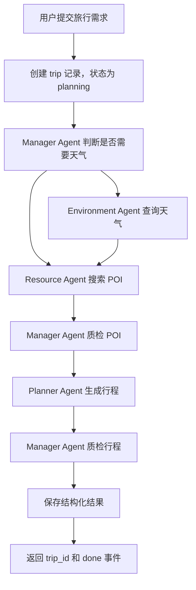
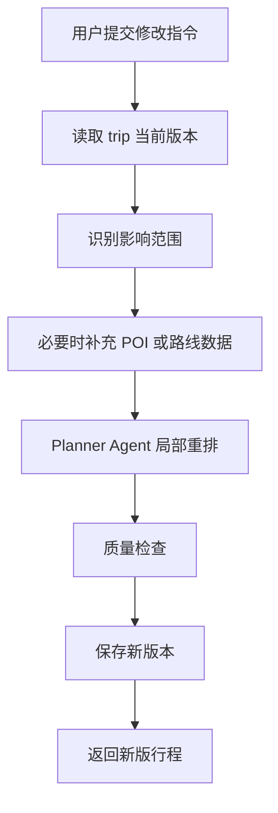

# Travel Agent C端产品 PRD

## 1. 产品定位

Travel Agent 是面向 C 端自由行用户的智能旅行规划产品。

它不是“旅游文案生成器”，也不是“攻略搜索工具”，而是帮助用户把模糊旅行想法转化为一份可执行、可调整、可解释的每日行程。

核心价值：

- 降低用户查攻略、筛地点、排路线的决策成本。
- 生成能落地执行的行程，而不是只给推荐清单。
- 让用户知道每个安排为什么合理，为什么避开某些地点。
- 支持用户继续修改，而不是每次重新生成。

## 2. 产品目标

当前项目已有后端智能体核心逻辑，包含 Manager Agent、Environment Agent、Resource Agent、Planner Agent。

下一阶段目标是把“智能体 Demo”产品化为“C 端可用的旅行规划后端”。

阶段目标：

1. 用户可以提交旅行需求并获得结构化行程。
2. 行程可以保存、查询、删除和再次修改。
3. 规划过程可以被前端实时展示。
4. 结果包含 POI、天气、交通、时间、推荐理由等可渲染字段。
5. 系统能提供基础质量保障，避免明显不可执行的行程。

## 3. 目标用户

### 3.1 核心用户

自由行用户。

典型特征：

- 已确定目的地和大致天数。
- 不想花大量时间查攻略。
- 希望行程包含景点、美食、住宿和交通。
- 希望安排符合天气、距离和个人偏好。
- 需要生成后继续调整。

### 3.2 首期不覆盖用户

以下场景不作为 MVP 重点：

- 旅行社批量定制线路。
- 企业差旅审批。
- 机票、酒店、门票交易闭环。
- 多人协同编辑。
- 跨国复杂签证与保险规划。

原因：当前项目的底层能力集中在 POI 搜索、天气判断、路线规划和智能体编排，最短产品化路径是先做好国内自由行规划。

## 4. 用户核心问题

用户真正要解决的不是“得到一段回答”，而是完成旅行前决策。

核心问题：

1. 去哪里：哪些地点值得去，哪些地点应该避开？
2. 什么时候去：天气、营业时间、游玩时长是否合适？
3. 怎么走：当天路线是否顺路，交通时间是否真实？
4. 吃什么：午餐、晚餐是否自然嵌入路线？
5. 住哪里：多日行程是否有住宿安排？
6. 怎么改：用户偏好变化后，是否能局部调整？

## 5. 当前能力基础

项目现有能力：

- FastAPI 后端服务。
- `/api/v1/travel/plan` SSE 规划接口。
- LangGraph 多智能体工作流。
- Manager Agent 负责任务调度和部分质检。
- Environment Agent 可查询天气并生成天气策略。
- Resource Agent 可基于高德地图和小红书搜索 POI。
- Planner Agent 可基于 POI 和地图工具生成结构化行程。
- PostgreSQL checkpointer 已用于 LangGraph 短期记忆。

当前主要缺口：

- 没有完整用户体系。
- 登录接口尚未形成业务闭环。
- 规划结果没有持久化。
- 用户无法查看历史行程。
- 用户无法修改已生成行程。
- SSE 过程事件不够细，前端难以展示智能体进度。
- Resource Agent 和 Planner Agent 的质量检查仍有 TODO。
- 行程结果没有版本管理。

## 6. MVP 范围

### 6.1 P0 基础功能

#### 6.1.1 用户认证

目标：让行程可以归属于具体用户。

功能：

- 用户注册。
- 用户登录。
- 获取当前用户信息。
- 接口鉴权。

接口：

```http
POST /api/v1/auth/register
POST /api/v1/auth/login
GET  /api/v1/auth/me
```

验收标准：

- 用户可以注册并登录。
- 登录成功返回访问凭证。
- 未登录用户不能查看和修改他人行程。
- 密码不能明文存储。

#### 6.1.2 创建旅行规划

目标：用户输入基础旅行需求，系统生成结构化行程。

输入字段：

- `location`: 目的地。
- `days`: 旅行天数。
- `start_date`: 开始日期，可选。
- `end_date`: 结束日期，可选。
- `preferences`: 偏好标签。
接口：

```http
POST /api/v1/travel/plan
```

输出：

- SSE 实时事件。
- 最终返回 `trip_id`。
- 最终行程保存到数据库。

验收标准：

- 生成结果包含每日行程。
- 每日行程包含时间段、地点、活动类型、交通节点。
- 多日行程包含住宿节点。
- 每天至少包含午餐和晚餐。
- 有日期时根据天气调整室内/室外安排。
- 规划完成后可以通过详情接口查询。

#### 6.1.3 行程保存与查询

目标：让用户可以管理历史行程。

接口：

```http
GET    /api/v1/trips
GET    /api/v1/trips/{trip_id}
DELETE /api/v1/trips/{trip_id}
```

验收标准：

- 用户可以查看自己的行程列表。
- 用户可以查看某个行程详情。
- 用户不能访问他人的行程。
- 删除行程后列表不再展示。

#### 6.1.4 规划过程事件

目标：让前端能展示“系统正在做什么”。

SSE 事件：

- `start`: 规划开始。
- `agent_step`: 当前智能体阶段。
- `tool_call`: 调用外部工具。
- `quality_check`: 质量检查结果。
- `message`: 最终内容流。
- `done`: 规划完成。
- `error`: 规划失败。

事件示例：

```json
{
  "event": "agent_step",
  "data": {
    "agent": "resource_agent",
    "status": "running",
    "message": "正在筛选景点、美食和住宿"
  }
}
```

验收标准：

- 前端可以展示当前执行到哪个阶段。
- 失败时返回明确错误。
- `done` 事件中包含 `trip_id`。

#### 6.1.5 行程局部修改

目标：用户不满意时，可以基于已有行程调整，而不是重新生成。

典型修改：

- 替换某个地点。
- 调整旅行节奏。
- 增加或删除偏好。
- 降低预算。
- 雨天重排。
- 减少步行。

接口：

```http
POST /api/v1/trips/{trip_id}/revise
```

请求示例：

```json
{
  "instruction": "第二天不要安排博物馆，换成小众街区和咖啡馆，节奏放慢一点"
}
```

验收标准：

- 修改基于已有行程上下文。
- 修改后生成新版本。
- 原版本不被覆盖。
- 用户可以查看最新版本。

### 6.2 P1 特色功能

#### 6.2.1 天气 Plan B

目标：天气不好时，不只是提醒用户，而是给出可执行备用方案。

功能：

- 对雨天、高温、强风、雷暴等天气生成备用路线。
- 每天支持 `primary_schedule` 和 `backup_schedule`。
- 天气严重不适合户外时，主行程直接切换为室内路线。

验收标准：

- `WARNING_RESTRICTED` 日期不能安排长时间户外活动。
- 雨天备用方案包含室内 POI。
- 备用方案仍包含餐饮和交通节点。

#### 6.2.2 避坑解释卡

目标：让推荐有依据，降低用户不信任感。

每个 POI 输出：

- 推荐理由。
- 可能风险。
- 适合人群。
- 价格参考。
- 来源摘要。

来源包括：

- 高德评分、地址、营业时间、价格。
- 小红书标题热度和避雷关键词。

验收标准：

- 每个核心 POI 至少有一个推荐理由。
- 出现明显负面信号时要写入 `risk_reason`。
- 避坑信息不影响结构化输出。

#### 6.2.3 行程质量评分

目标：让用户快速判断计划是否靠谱。

评分维度：

- 路线顺畅度。
- 时间连续性。
- 天气适配度。
- 餐饮完整度。
- POI 多样性。
- 步行强度。

输出示例：

```json
{
  "quality_score": 86,
  "score_items": [
    {"name": "路线顺畅度", "score": 90, "reason": "当日 POI 集中在同一区域"},
    {"name": "天气适配度", "score": 80, "reason": "雨天已减少户外活动"}
  ]
}
```

验收标准：

- 每份行程有总分。
- 每个评分项有原因。
- 低于阈值时触发 Planner Agent 重新规划。

#### 6.2.4 导出行程

目标：用户可以保存或分享行程。

首期支持：

- Markdown。
- JSON。

接口：

```http
GET /api/v1/trips/{trip_id}/export?format=markdown
GET /api/v1/trips/{trip_id}/export?format=json
```

暂不做 PDF，原因是 PDF 涉及样式、分页和视觉质量，优先级低于核心规划闭环。

## 7. 暂不做功能

MVP 不做：

- 酒店、机票、门票下单。
- 支付。
- 多人协作。
- 社交分享广场。
- 复杂后台运营系统。
- 国际旅行签证规划。

原因：这些功能会显著扩大系统边界，但不能解决当前最核心的问题：把现有智能体结果变成可保存、可修改、可验证的 C 端旅行规划产品。

## 8. 核心业务流程

### 8.1 创建行程



### 8.2 修改行程



## 9. 数据模型

### 9.1 users

用户表。

字段：

- `id`
- `username`
- `password_hash`
- `created_at`
- `updated_at`

### 9.2 trips

行程主表。

字段：

- `id`
- `user_id`
- `title`
- `location`
- `days`
- `start_date`
- `end_date`
- `preferences`
- `status`: `planning` / `completed` / `failed`
- `created_at`
- `updated_at`

### 9.3 trip_versions

行程版本表。

字段：

- `id`
- `trip_id`
- `version_no`
- `source`: `initial` / `revision`
- `revision_instruction`
- `content_json`
- `quality_score`
- `created_at`

### 9.4 poi_candidates

候选 POI 表。

字段：

- `id`
- `trip_id`
- `amap_poi_id`
- `name`
- `category`
- `tags`
- `location`
- `rating`
- `price`
- `open_time`
- `suggested_duration`
- `photo`
- `recommend_reason`
- `risk_reason`
- `source_summary`

### 9.5 agent_runs

智能体执行记录表。

字段：

- `id`
- `trip_id`
- `agent_name`
- `status`
- `input_summary`
- `output_summary`
- `error_message`
- `started_at`
- `ended_at`

### 9.6 tool_call_logs

工具调用记录表。

字段：

- `id`
- `agent_run_id`
- `tool_name`
- `request_json`
- `response_summary`
- `status`
- `latency_ms`
- `created_at`

## 10. API 设计

### 10.1 注册

```http
POST /api/v1/auth/register
```

请求：

```json
{
  "username": "user001",
  "password": "password123"
}
```

响应：

```json
{
  "code": 200,
  "message": "success",
  "error_message": null,
  "data": {
    "user_id": "xxx"
  }
}
```

### 10.2 登录

```http
POST /api/v1/auth/login
```

响应：

```json
{
  "code": 200,
  "message": "success",
  "error_message": null,
  "data": {
    "access_token": "xxx",
    "token_type": "bearer"
  }
}
```

### 10.3 创建规划

```http
POST /api/v1/travel/plan
```

请求：

```json
{
  "location": "上海市",
  "days": 3,
  "start_date": "2026-05-01",
  "end_date": "2026-05-03",
  "preferences": "美食,历史,小众探索",
}
```

SSE 完成事件：

```json
{
  "event": "done",
  "data": {
    "trip_id": "trip_xxx",
    "thread_id": "thread_xxx",
    "end_at": 1770000000
  }
}
```

### 10.4 行程详情

```http
GET /api/v1/trips/{trip_id}
```

响应核心结构：

```json
{
  "id": "trip_xxx",
  "title": "上海3日美食文化游",
  "location": "上海市",
  "days": 3,
  "latest_version": {
    "version_no": 1,
    "quality_score": 86,
    "trip_overview": {},
    "daily_itinerary": []
  }
}
```

### 10.5 修改行程

```http
POST /api/v1/trips/{trip_id}/revise
```

请求：

```json
{
  "instruction": "第三天减少步行，增加咖啡馆和室内展览"
}
```

验收标准：

- 返回新的 `version_no`。
- 原版本保留。
- 修改后的行程仍通过质量检查。

## 11. 行程结果结构

最终结构应优先服务前端渲染。

顶层结构：

```json
{
  "trip_overview": {
    "title": "上海3日美食文化游",
    "total_distance_km": 42.6,
    "tags": ["美食", "历史", "小众探索"],
    "quality_score": 86
  },
  "daily_itinerary": [
    {
      "day": 1,
      "date": "2026-05-01",
      "weather_label": "OUTDOOR_PREFERRED",
      "schedule": []
    }
  ]
}
```

活动节点：

```json
{
  "seq": 1,
  "time_window": "09:00-11:00",
  "poi_id": "B0xxx",
  "poi_name": "外滩",
  "category": "CORE_SIGHTSEEING",
  "action": "浏览",
  "duration_hour": 2,
  "cost": 0,
  "reason": "天气晴朗，适合安排城市地标步行游览",
  "risk_reason": "",
  "photo": "https://example.com/photo.jpg",
  "location": "121.490317,31.241701"
}
```

交通节点：

```json
{
  "seq": 2,
  "time_window": "11:00-11:20",
  "action": "通勤",
  "transport_mode": "walking",
  "distance_meter": 800,
  "commute_time_min": 20,
  "from_poi": "外滩",
  "to_poi": "南京东路"
}
```

## 12. 质量规则

### 12.1 POI 质量规则

必须满足：

- POI 数量不少于 `days * 4 + 3`。
- 至少包含景点和餐饮。
- 多日行程必须包含住宿。
- 每个 POI 必须有名称、分类和坐标。
- 评分过低或明显负面的小红书结果应降低优先级。

### 12.2 行程质量规则

必须满足：

- 时间段不能重叠。
- 交通时间不能明显不合理。
- 每天包含午餐和晚餐。
- 多日行程每天结束应有住宿或休息节点。
- 恶劣天气不能安排长时间户外。
- 单日总距离过长时需要重排。

### 12.3 失败处理

当外部工具失败时：

- 高德 POI 失败：返回可解释错误，不生成空行程。
- 小红书失败：降级为仅使用高德数据。
- 天气失败：降级为无天气计划，但需要标记 `weather_label = DATA_UNAVAILABLE`。
- 地图路线失败：可以用估算交通时间，但必须标记 `estimated = true`。

## 13. 非功能需求

### 13.1 性能

- 创建规划首包响应小于 2 秒。
- SSE 每个阶段至少产生一次状态事件。
- 3 日行程完整生成建议小于 90 秒。

### 13.2 稳定性

- 外部工具调用必须有超时。
- 失败必须进入 `error` 事件。
- 规划失败时 `trip.status = failed`。

### 13.3 可观测性

- 记录每次 agent 执行。
- 记录工具调用耗时。
- 记录失败原因。
- 支持按 `trip_id` 查询执行过程。

### 13.4 安全

- API Key 不进入响应。
- 用户只能访问自己的行程。
- 密码哈希存储。
- 日志避免输出敏感 token。

## 14. 里程碑

### Milestone 1：数据闭环

目标：生成结果可保存、可查询。

范围：

- trips 表。
- trip_versions 表。
- `/trips` 查询接口。
- `/travel/plan` 完成后保存结果。

### Milestone 2：用户体系

目标：行程归属到用户。

范围：

- 注册。
- 登录。
- 鉴权依赖。
- 用户维度行程隔离。

### Milestone 3：规划过程可视化

目标：前端能展示智能体执行阶段。

范围：

- SSE 事件扩展。
- agent_runs。
- tool_call_logs。

### Milestone 4：行程修改

目标：用户可以基于已有结果继续调整。

范围：

- revise 接口。
- trip_versions。
- 局部重排。
- 版本保留。

### Milestone 5：特色体验

目标：形成区别于普通 AI 问答的产品能力。

范围：

- 天气 Plan B。
- 避坑解释卡。
- 行程质量评分。
- Markdown / JSON 导出。

## 15. 成功指标

MVP 技术验收：

- 规划成功率大于 80%。
- 规划完成后结构化结果可被稳定解析。
- 查询历史行程成功率 100%。
- 用户不能越权访问他人行程。
- 外部工具失败时系统能降级或返回明确错误。

C 端产品指标：

- 用户生成后继续修改的比例。
- 用户保存行程的比例。
- 用户导出或分享行程的比例。
- 单次规划平均耗时。
- 规划失败率。

## 16. 优先级结论

下一阶段不要优先增加更多智能体。

原因：当前瓶颈不是智能体数量，而是产品闭环缺失。用户需要的是可保存、可查看、可修改、可信任的行程对象。

最短路径：

1. 做行程持久化。
2. 做用户认证。
3. 做行程查询。
4. 扩展 SSE 阶段事件。
5. 做 revise 修改接口。
6. 再做天气 Plan B、避坑解释和质量评分。
